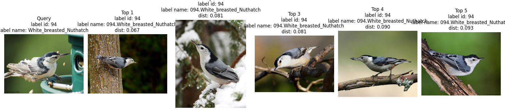
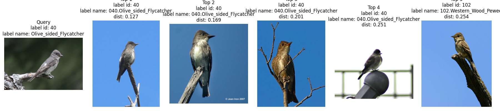
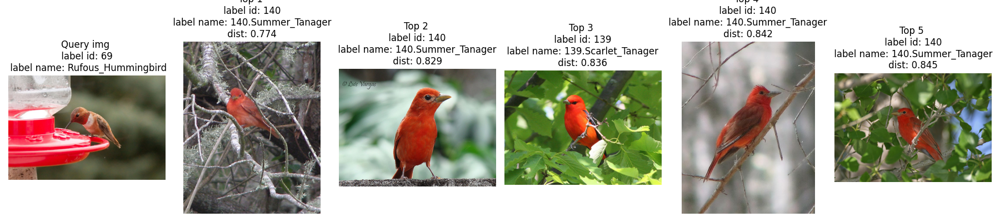
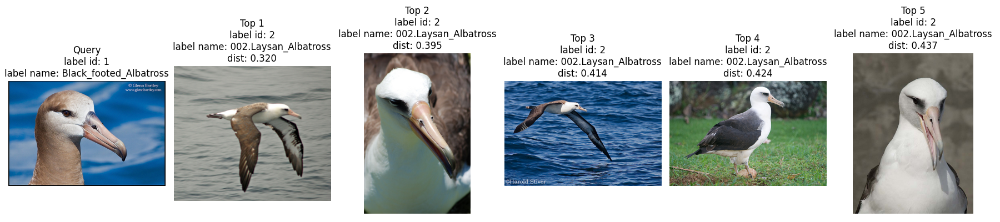
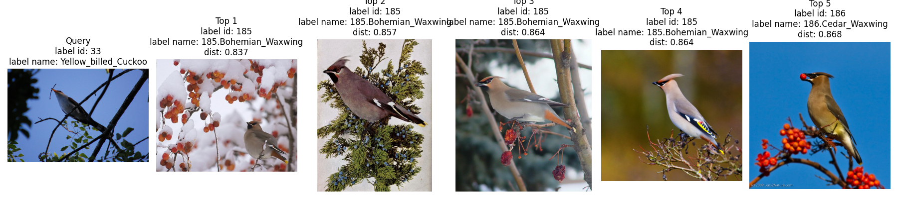

# Image Retrieval on CUB-200-2011

Fine-grained image retrieval experiments on CUB-200-2011 using a ResNet50 embedding model, ProxyNCA loss, PK sampling, and retrieval metrics such as Recall@K and mAP.

## Current Best Result

- Dataset: CUB-200-2011
- Backbone: ResNet50 (ImageNet pretrained)
- Embedding dim: 256
- Loss: ProxyNCA
- Scheduler: StepLR (`step_size=10`, `gamma=0.2`)
- Sampler: `p=16`, `k=2`
- mAP: `0.6442`
- Recall@1: `0.7206`

## Experiments

The table below summarizes the main turning points instead of every trial. The goal is to show how the project moved from a plain triplet baseline to the current best ProxyNCA recipe.

| Setting | Loss | embed_dim | lr | mAP | Recall@1 |
| --- | --- | --- | --- | --- | --- |
| Triplet baseline | Triplet | 128 | 1e-4 | 0.5474 | 0.7095 |
| First strong ProxyNCA run | ProxyNCA | 64 | 1e-4 | 0.6022 | 0.6938 |
| Better overall ranking | ProxyNCA | 128 | 1e-4 | 0.6148 | 0.7047 |
| Best pre-normalization recipe | ProxyNCA | 256 | 1e-4 | 0.6200 | 0.6949 |
| Add ImageNet normalization | ProxyNCA + scheduler | 256 | 1e-4 | 0.6284 | 0.7061 |
| Current best (`p=16, k=2`) | ProxyNCA + scheduler | 256 | 1e-4 | **0.6442** | **0.7206** |

Key lessons from these experiments:

- Switching from Triplet to ProxyNCA gave the biggest jump in retrieval mAP.
- Aligning input preprocessing with the ImageNet-pretrained backbone was a real win, not a cosmetic cleanup.
- PK sampler structure mattered a lot: `p=16, k=2` outperformed both the old `8x4` recipe and later larger-batch variants.

## Failure Case Analysis

Typical failure modes looked like this:

1. Context-driven color bias: the model sometimes over-weighted scene and color cues. A good example was a Rufous Hummingbird query near a red feeder being retrieved as Summer/Scarlet Tanager-style red birds.
2. Lighting and color shift: the same species under different illumination could look surprisingly different in embedding space.
3. Fine-grained confusion: closely related species with very small visual differences remained genuinely hard even for humans.

Representative qualitative examples generated with the current best checkpoint:

| Case | Example |
| --- | --- |
| Clean same-species retrieval |  |
| Strong same-species cluster with one near-neighbor miss at rank 5 |  |
| Context-driven color bias on a red feeder scene |  |
| Fine-grained confusion inside a visually similar seabird group |  |
| Severe semantic failure on a difficult query |  |

## Repository Layout

- `src/`: training, evaluation, model, dataset, sampler, and visualization code
- `configs/default.yaml`: default training recipe
- `scripts/run_sweep.py`: local sweep entry point
- `notebooks/`: failure-case analysis notebook

Large experiment artifacts are intentionally excluded from git:

- `data/`
- `checkpoints/`
- `results/`

## Setup

Recommended: Python 3.10+.

Install dependencies:

```bash
python -m venv .venv
source .venv/bin/activate
pip install -r requirements.txt
```

## Dataset

This project expects the CUB-200-2011 dataset under:

```bash
data/CUB_200_2011
```

The default config points to:

```yaml
data:
  root: data/CUB_200_2011
```

## Train

Run training with the default config:

```bash
python src/train.py
```

Run with a specific config:

```bash
python src/train.py --config <config_path>
```

Resume from a checkpoint:

```bash
python src/train.py --resume <checkpoint_path>
```

## Evaluate

Evaluate a checkpoint:

```bash
python src/evaluate.py --checkpoint <checkpoint_path>
```

Save failure cases during evaluation:

```bash
python src/evaluate.py --checkpoint <checkpoint_path> --save_fail
```

## Query Visualization

Visualize nearest retrieved images for a query:

```bash
python src/visualise.py --checkpoint <checkpoint_path> --q_image <query_image_path> --q_num 5
```

Query figures are saved under:

```bash
results/query_results/
```

## Sweeps

Run the local sweep script:

```bash
python scripts/run_sweep.py
```

Sweep summaries are written to:

```bash
results/sweeps/
```

## Notes

- The current default config already reflects the strongest recipe found so far.
- Training-time validation uses retrieval mAP rather than loss-only validation.
- The notebooks are templates and expect local experiment artifacts to exist under `results/` and `checkpoints/`.
- Typical values:
  - `<config_path>`: `configs/default.yaml`
  - `<checkpoint_path>`: `checkpoints/<run_id>/best.pth`
